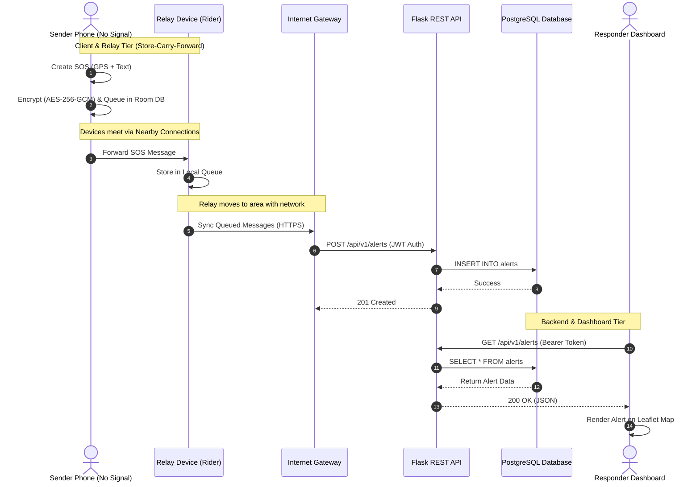
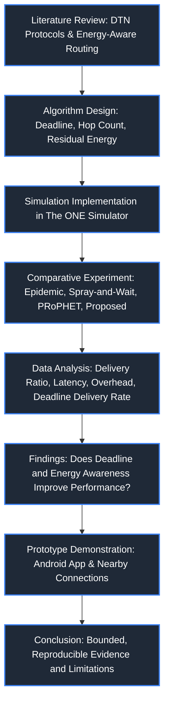
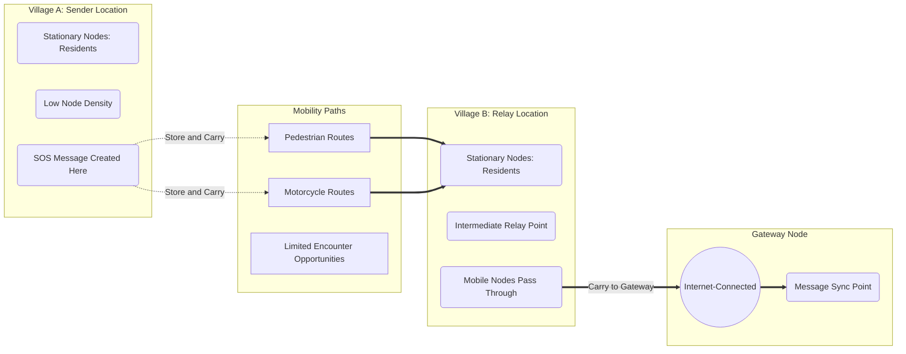

### Figure 10.1: EmergencyLink System Architecture and Message Flow

```mermaid
sequenceDiagram
    autonumber
    actor Sender as Sender Phone (No Signal)
    participant Relay as Relay Device (Rider)
    participant Gateway as Internet Gateway
    participant API as Flask REST API
    participant DB as PostgreSQL Database
    actor Responder as Responder Dashboard

    Note over Sender, Relay: Client & Relay Tier (Store-Carry-Forward)
    
    Sender->>Sender: Create SOS (GPS + Text)
    Sender->>Sender: Encrypt (AES-256-GCM) & Queue in Room DB
    
    Note over Sender, Relay: Devices meet via Nearby Connections
    
    Sender->>Relay: Forward SOS Message
    Relay->>Relay: Store in Local Queue
    
    Note over Relay, Gateway: Relay moves to area with network
    
    Relay->>Gateway: Sync Queued Messages (HTTPS)
    Gateway->>API: POST /api/v1/alerts (JWT Auth)
    API->>DB: INSERT INTO alerts
    DB-->>API: Success
    API-->>Gateway: 201 Created
    
    Note over Responder, DB: Backend & Dashboard Tier
    
    Responder->>API: GET /api/v1/alerts (Bearer Token)
    API->>DB: SELECT * FROM alerts
    DB-->>API: Return Alert Data
    API-->>Responder: 200 OK (JSON)
    Responder->>Responder: Render Alert on Leaflet Map
```

### Figure 10.2: Research Design Flow

```mermaid
flowchart TD
    A[Literature Review: DTN Protocols & Energy-Aware Routing] --> B[Algorithm Design: Deadline, Hop Count, Residual Energy]
    B --> C[Simulation Implementation in The ONE Simulator]
    C --> D[Comparative Experiment: Epidemic, Spray-and-Wait, PRoPHET, Proposed]
    D --> E[Data Analysis: Delivery Ratio, Latency, Overhead, Deadline Delivery Rate]
    E --> F[Findings: Does Deadline and Energy Awareness Improve Performance?]
    F --> G[Prototype Demonstration: Android App & Nearby Connections]
    G --> H[Conclusion: Bounded, Reproducible Evidence and Limitations]
    
    style A fill:#1f2937,stroke:#3b82f6,stroke-width:2px,color:#fff
    style B fill:#1f2937,stroke:#3b82f6,stroke-width:2px,color:#fff
    style C fill:#1f2937,stroke:#3b82f6,stroke-width:2px,color:#fff
    style D fill:#1f2937,stroke:#3b82f6,stroke-width:2px,color:#fff
    style E fill:#1f2937,stroke:#3b82f6,stroke-width:2px,color:#fff
    style F fill:#1f2937,stroke:#3b82f6,stroke-width:2px,color:#fff
    style G fill:#1f2937,stroke:#3b82f6,stroke-width:2px,color:#fff
    style H fill:#1f2937,stroke:#3b82f6,stroke-width:2px,color:#fff
```

### Figure 10.3: The ONE Simulator Scenario Layout

```mermaid
flowchart LR
    subgraph VILLAGE_A [Village A: Sender Location]
        direction TB
        VA1(Stationary Nodes: Residents)
        VA2(Low Node Density)
        VA3(SOS Message Created Here)
    end

    subgraph PATH [Mobility Paths]
        direction TB
        P1[Pedestrian Routes]
        P2[Motorcycle Routes]
        P3[Limited Encounter Opportunities]
    end

    subgraph VILLAGE_B [Village B: Relay Location]
        direction TB
        VB1(Stationary Nodes: Residents)
        VB2(Intermediate Relay Point)
        VB3(Mobile Nodes Pass Through)
    end

    subgraph GATEWAY [Gateway Node]
        direction TB
        G1((Internet-Connected))
        G2(Message Sync Point)
    end

    VA3 -.->|Store and Carry| P1
    VA3 -.->|Store and Carry| P2
    P1 ==> VB1
    P2 ==> VB1
    VB3 ==>|Carry to Gateway| G1
    G1 ==> G2
```

